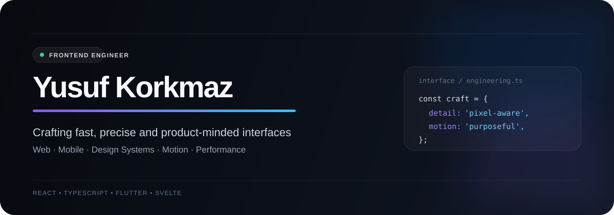

<p align="center">
  
</p>

## I build interfaces that feel finished.

I’m a **frontend-focused software developer** working across web and mobile. I care about the layer users actually touch: visual hierarchy, interaction, responsive behavior, perceived performance, component quality, and the small details that separate a working screen from a polished product.

My approach is simple: **design intent should survive implementation**. That means clean UI architecture, deliberate motion, predictable states, maintainable components, and no “close enough” frontend work.

### What I optimize for

- **UI architecture** — reusable components, clear boundaries, scalable frontend structure
- **Responsive systems** — layouts that stay intentional across real screen sizes
- **Interaction & motion** — animation used for hierarchy, feedback, and continuity
- **Performance** — fast loading, smooth runtime behavior, fewer unnecessary renders
- **Product quality** — loading, empty, error and edge states treated as first-class UI
- **Design fidelity** — translating visual decisions into precise implementation without brittle CSS

### Core stack

```text
Web        React · TypeScript · JavaScript · Svelte · HTML · CSS
Mobile     Flutter · Dart
UI         Design Systems · Responsive UI · Motion · Accessibility
Tooling    Vite · Git · REST APIs · CI/CD
```

### Frontend principles I work by

```ts
const frontend = {
  components: "reusable, not page-specific",
  responsive: "designed, not patched",
  motion: "purposeful, not decorative",
  performance: "part of UX",
  states: ["loading", "empty", "error", "success"],
  detail: "pixel-aware",
};
```

I’m especially interested in frontend work where **engineering and visual craft meet**: product interfaces, design systems, high-fidelity implementations, complex responsive layouts, interaction-heavy experiences, and performance-sensitive UI.

---

<p align="center">
  <a href="https://yusufkorkmaz.dev"><b>Portfolio</b></a>
  &nbsp;&nbsp;·&nbsp;&nbsp;
  <a href="https://www.linkedin.com/in/yusufkorkmaz98/"><b>LinkedIn</b></a>
</p>
